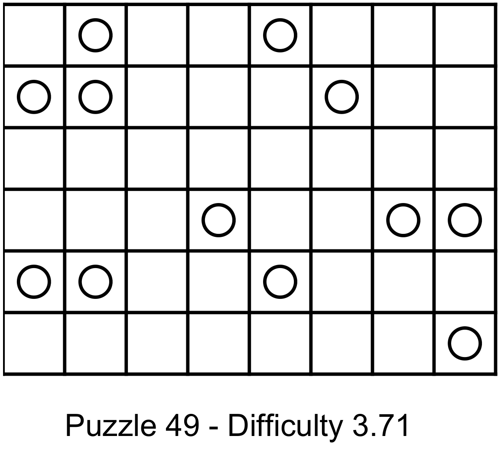
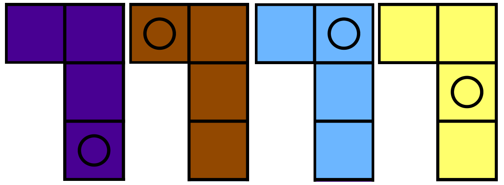
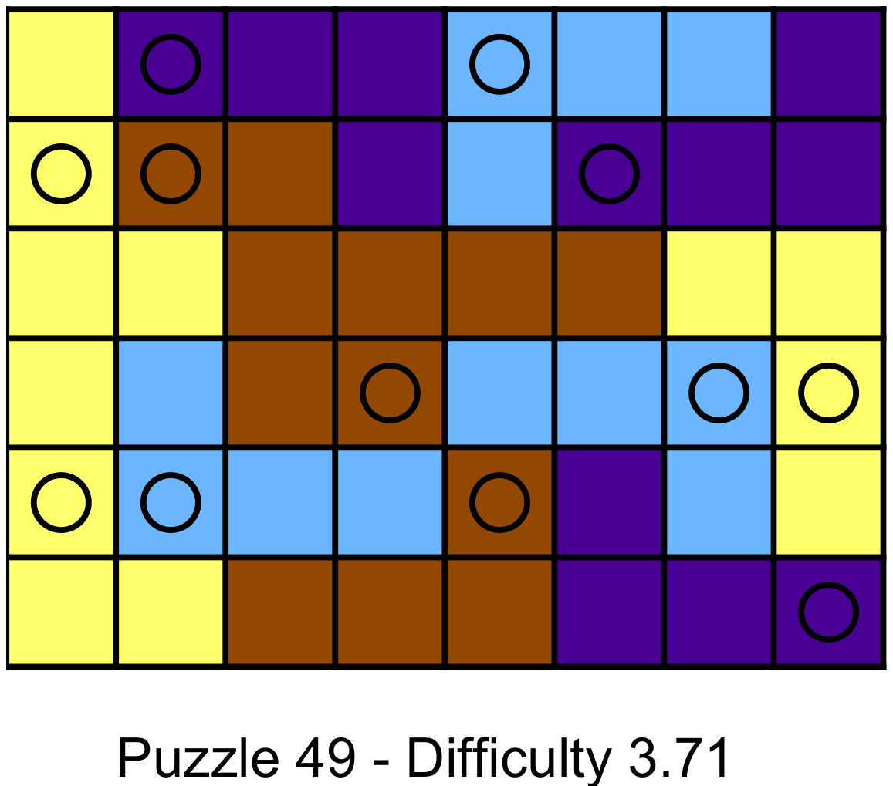

#L-Puzzle solver#

This is a small set of classes designed to help build and solve L-Puzzles, which I first learned about from [Lateral Thinking](http://www.amazon.com/Lateral-Thinking-Puzzles-Large-Print-ebook/dp/B00CPNQZ4A/ref=sr_1_1?ie=UTF8&qid=1419618096&sr=8-1&keywords=lateral+thinking+arcturus), a puzzle book.

Given a board that has twelve pegs in it like:

and 3 of each of the following pieces, each with a hole in it:

can you find an arrangement of the pieces so that the board is filled and
no alike pieces touch, even at a corner.
You can rotate and flip the pieces however you like.

One solution is:

The first time I saw a puzzle like this, it took about 25 minutes to solve one.
A little bit of combinatorics thinking showed that there are about [25 quadrillion combinations](http://www.wolframalpha.com/input/?i=%2812+choose+3%29%289+choose+3%29%286+choose+3%29%288%5E12%29) of pieces, rotations and pegs for any given 6x8 puzzle and
[17 sextillion](http://www.wolframalpha.com/input/?i=%2816+choose+4%29%2812+choose+4%29%288+choose+4%29%288%5E16%29) combinations for an 8x8.
This is a lot (a Rubik's Cube has about 43 quintillion, for comparision) and I was curious if I could find a tractable algorithm to solve these.

After a bit of trial, error and remembering my matrix rotation theory, I came up with both a way to represent the puzzle and then solve it.
Most puzzles are solved in milliseconds with a heuristic (detailed below) that can prune the search space down to tens of millions of combinations in the worst case.
You can even generate a random puzzle in about 30-45 seconds (there are many arrangements that lack solutions).

###Heuristic for solving L-Puzzles###
1. Start with an empty board (just the pegs).
2. Find a peg that has the fewest legal piece-rotation pairs, by throwing out all possibilities that go off the board or overlap another peg.  If there is a peg that has 0 legal pairs, bail out (no solution).
3. Place one of the piece-rotation pairs on that peg.  (In later steps, check to make sure the piece is far enough from other pieces of the same type).
4. Repeat step 2.  If step 2 fails, keep trying piece-rotation pairs on the given peg.
5. If you've exhausted all piece-rotation pairs, there is no solution, give up and back-track.

Surprisingly, this simple heuristic solves a puzzle very quickly.
In many puzzles, from an empty board, there are a few pegs that have five or fewer valid piece-rotation pairs, instead of the 32 (4 pieces, 8 rotations) that make the puzzle intractable.

###Other sizes###
An 8x8 puzzle can be solved using 16 pegs and 4 of each piece.

###Open Source License###
This project is released Open Source under the Apache 2.0 License.
See the LICENSE file in the root of the repo for more information.