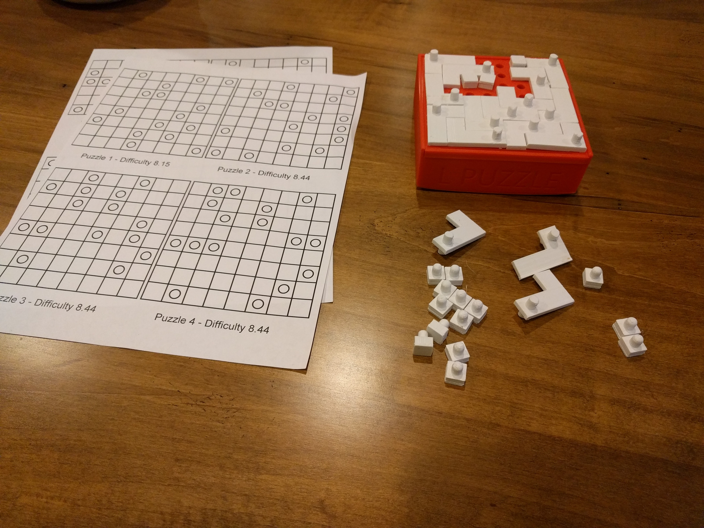
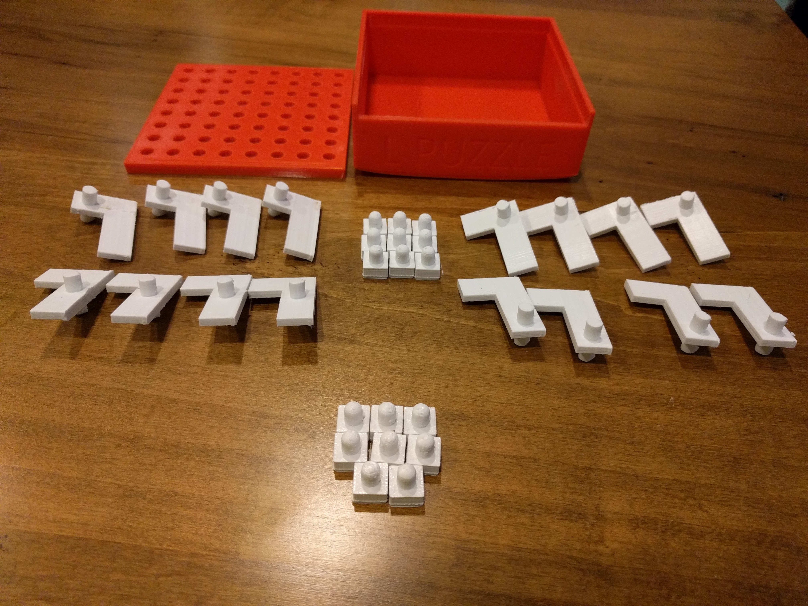
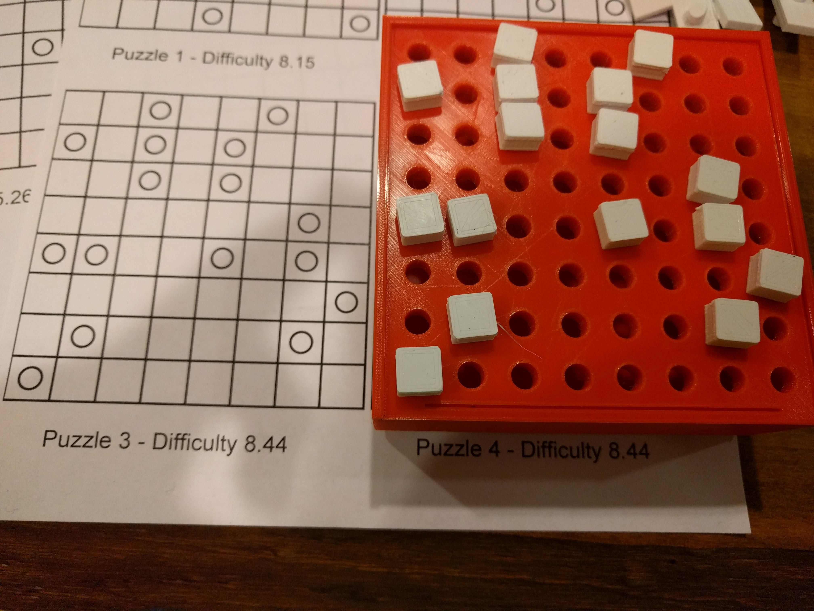
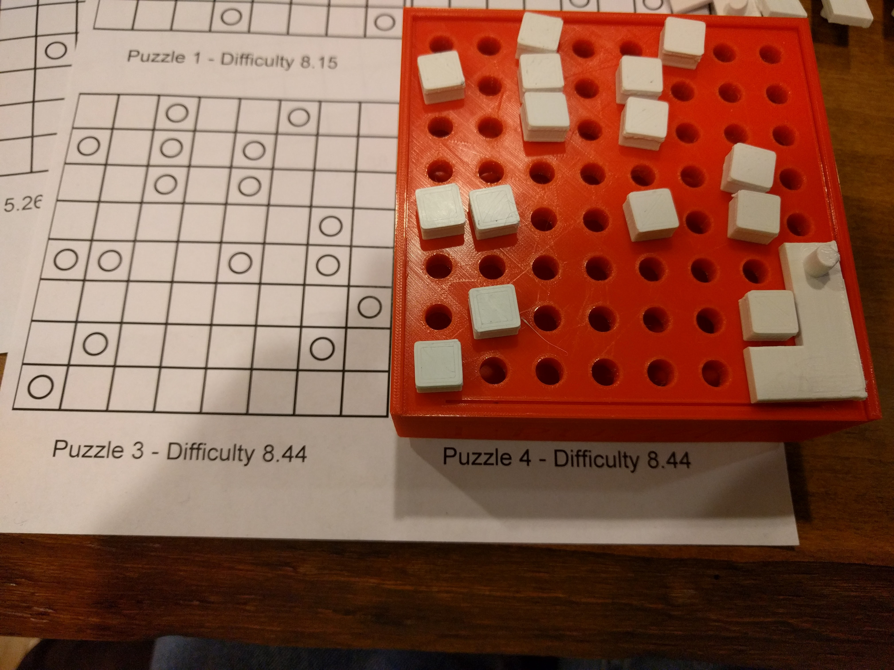
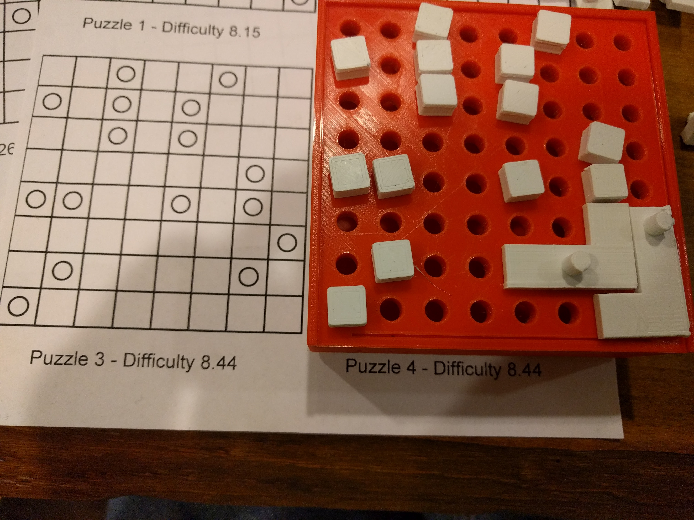

# 3d Printing a L-puzzle solving box.

I enjoy solving these with my hands instead of just on paper.
I designed a box that has a slide out lid and can support 6x8 and 8x8 puzzles.

These STL files can be printed out to make one yourself.
Unlike the "theoretical" game, the 3d-printed ones have an integrated peg, rather than a whole.
This makes it fit better together.

A typical print will involve:

- 1 x [L-puzzle_board.stl](https://tinkercad.com/things/2YUs7paEJ9M)
- 1 x [L_puzzle_box.stl](https://tinkercad.com/things/ds5OYtiiW2R)
- 3 x [L_pieces.stl](https://tinkercad.com/things/gOuzUWkGG5E)
- 16 x [Extra_pin.stl](https://tinkercad.com/things/aTZkPdDw5kh) (I usually print a spare)

This printed fine on an Ultimaker 2 at high settings (.6mm layer height, .25mm nozzle).
Be sure to use glue for better adhesion on the box and board, if applicable.

I've linked the above models to their TinkerCAD sources for more fine-grain editing.

## How to play with the pieces

Set up the board using the filler pins to represent where pins should go.

Remove one of the pins and place a piece, aligning the piece so the pin goes where the filler pin was.

Repeat this for more pieces

